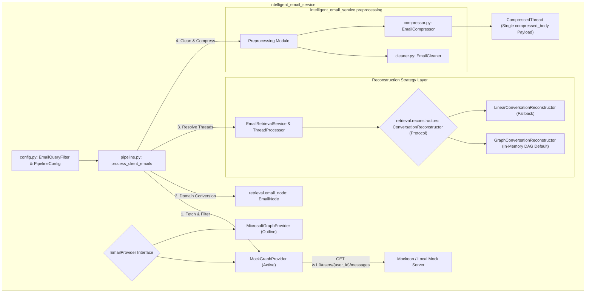

# Architecture

_Last updated: August 3, 2026_

> [!IMPORTANT]
> **Implementation Status**: The core processing, retrieval, cleaning, context compression, domain model (`EmailNode`), strategy reconstruction (`ConversationReconstructor`), and pipeline execution modules are fully implemented in `intelligent_email_service`. Microsoft Graph API support is currently an outline (`MicrosoftGraphProvider`), and local development uses `MockGraphProvider` pointing to a local mock endpoint.

The Intelligent Email Service is designed to ingest email mailbox data (via local mock endpoints or Microsoft Graph API), resolve and filter thread history using an in-memory Directed Acyclic Graph (DAG), preprocess and clean email bodies, and output streamlined `CompressedThread` JSON payloads optimized for downstream LLM context windows.

---

## Overview

Given a financial advisor's mailbox and a target client (or household) email address, this service:
1. Connects to the mailbox via an extensible provider interface (`EmailProvider`).
2. Queries historical email messages matching client identifiers (`from`, `toRecipients`, `ccRecipients`).
3. Converts incoming message payloads into strongly-typed `EmailNode` domain objects.
4. Groups correspondence by normalized subject line and resolves thread history using the `ConversationReconstructor` strategy pattern (`GraphConversationReconstructor` in-memory DAG by default).
5. Preprocesses email bodies (stripping HTML, signatures, and whitespace via `EmailCleaner`).
6. Compresses historical thread context into a single unified `compressed_body` per subject via `EmailCompressor`.
7. Emits structured `CompressedThread` JSON payloads tailored for LLM prompt context injection via `process_client_emails`.

---

## System Component Architecture

---

## Configuration Object Pattern

The service enforces the **Configuration Object Pattern** to eliminate long parameter lists and encapsulate settings:

- **`EmailQueryFilter`**: Groups search criteria (`advisor_id`, `client_id`, `start_date`, `end_date`).
- **`CleanerConfig`**: Groups HTML tag stripping, signature patterns, and whitespace normalization settings.
- **`CompressorConfig`**: Groups LLMLingua compression rates, target device (`llmlingua_device="cpu"`), model choices, and character truncation limits.
- **`PipelineConfig`**: Top-level configuration object bundling `cleaner`, `compressor`, and concurrency settings.

---

## Data Flow Pipeline & Performance Design

1. **Pipeline Invocation**: The entry point [`process_client_emails(query, provider, config)`](file:///Users/aj/Documents/Cognicor_Internship/email_service/src/intelligent_email_service/pipeline.py) receives structured configuration objects.
2. **Mailbox Search & Retrieval**: Query the advisor's mailbox via `EmailRetrievalService.get_client_emails()`, converting incoming message payloads into `EmailNode` objects.
3. **Subject & Thread Grouping**:
   - Normalize subject lines using `normalize_subject()`.
   - Group matched messages by normalized subject via `_group_by_subject()`.
4. **In-Memory DAG Thread Reconstruction**:
   - `ThreadProcessor` delegates thread ordering to `ConversationReconstructor` (defaulting to `GraphConversationReconstructor`).
   - **`GraphConversationReconstructor`**: Indexes `EmailNode` objects by `message_id` and `in_reply_to` headers to construct an in-memory Directed Acyclic Graph (DAG). Performs topological Depth-First Search (DFS) traversal to group parent messages and branching replies accurately.
   - **`FULL_QUOTED` Threads**: If the latest message contains embedded quoted history (matching `QUOTED_HEADER_PATTERNS`), `ThreadProcessor` retains only the latest `EmailNode`.
   - **`MODIFIED` Threads**: If history is not quoted, `ThreadProcessor` fetches complete conversation nodes via `conversation_id` and applies DAG reconstruction.

5. **Preprocessing & Cleaning** (`intelligent_email_service.preprocessing.cleaner`):
   - Perform HTML stripping and signature removal via `EmailCleaner(config=config.cleaner)`.
   - Populates `EmailNode.cleaned_body`.
6. **Unified Context Compression** (`intelligent_email_service.preprocessing.compressor`):
   - `EmailCompressor.compress_processed_thread()` transforms `ProcessedThread` into a `CompressedThread`.
   - **FULL_QUOTED Format**: Takes the single latest `EmailNode` body, cleans/compresses it, and sets top-level `compressed_body`.
   - **MODIFIED Format**: Combines all chronological `EmailNode` bodies into a unified thread text, cleans/compresses the combined text, and sets top-level `compressed_body`.
   - Emits total estimated tokens based on `compressed_body` (`math.ceil(len / 4.0)`).
7. **Structured Output**: Emits streamlined `CompressedThread` JSON payloads containing top-level `subject`, `conversation_id`, `format`, `total_messages`, `compressed_body`, `attachments_summary`, `estimated_tokens`, and `used_llmlingua`.
