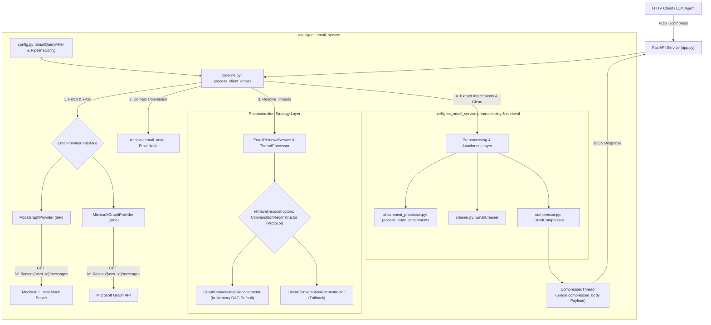

# Architecture

_Last updated: August 12, 2026_

> [!NOTE]
> **Implementation Status**: All core service components — mailbox retrieval (`EmailRetrievalService`), Microsoft Graph API provider (`MicrosoftGraphProvider`), mock provider (`MockGraphProvider`), DAG thread reconstruction (`GraphConversationReconstructor`), attachment text extraction (`process_node_attachments`), email body cleaning (`EmailCleaner`), context compression (`EmailCompressor`), and driver pipeline (`process_client_emails`) — are fully implemented in `intelligent_email_service`.

The Intelligent Email Service is designed to ingest email mailbox data (via Microsoft Graph API or local mock servers), resolve and filter thread history using an in-memory Directed Acyclic Graph (DAG), extract readable attachment text, preprocess and clean email bodies, and output streamlined `CompressedThread` JSON payloads optimized for downstream LLM context windows.

---

## Overview

Given a financial advisor's mailbox and a target client (or household) email address, this service:
1. Connects to the mailbox via an extensible provider interface (`EmailProvider`).
2. Queries historical email messages matching client identifiers (`from`, `toRecipients`, `ccRecipients`).
3. Converts incoming message payloads into strongly-typed `EmailNode` domain objects.
4. Groups correspondence by normalized subject line and resolves thread history using the `ConversationReconstructor` strategy pattern (`GraphConversationReconstructor` in-memory DAG by default).
5. Extracts readable attachment text via `process_node_attachments()`.
6. Preprocesses email bodies (stripping HTML, signatures, and whitespace via `EmailCleaner`).
7. Compresses historical thread context into a single unified `compressed_body` per subject via `EmailCompressor`.
8. Emits structured `CompressedThread` JSON payloads tailored for LLM prompt context injection via `process_client_emails` and the FastAPI REST interface (`intelligent_email_service.app`).

---

## System Component Architecture

---

## Environment-Driven Configuration Pattern

The service enforces the **Environment-Driven Configuration Pattern**, enabling every setting to be configured via environment variables with safe defaults:

- **`EmailQueryFilter`**: Groups query criteria (`advisor_id`, `client_id`, `start_date`, `end_date`).
- **`CleanerConfig`**: HTML stripping, signature patterns (`CLEANER_STRIP_SIGNATURES`), and whitespace limits (`CLEANER_MAX_BLANK_LINES`).
- **`CompressorConfig`**: Compression engine settings (`USE_LLMLINGUA`), Hugging Face model (`LLMLINGUA_MODEL`), target compute device (`LLMLINGUA_DEVICE`), and character truncation caps (`COMPRESSOR_MAX_FULL_BODY_CHARS`).
- **`MicrosoftGraphConfig`**: Base Graph endpoint (`GRAPH_API_BASE_URL`) and OData page size (`GRAPH_PAGE_SIZE`).
- **`PipelineConfig`**: Top-level bundle reading `APP_ENV`, `LOG_LEVEL`, `MAX_CONCURRENCY`, `cleaner`, `compressor`, and `graph`.

---

## Data Flow Pipeline & Execution Design

1. **Pipeline Invocation**: Entry point [`process_client_emails(query, provider, config)`](file:///Users/aj/Documents/Cognicor_Internship/email_service/src/intelligent_email_service/pipeline.py) receives structured query and configuration objects.
2. **Mailbox Search & Retrieval**: Queries advisor's mailbox via `EmailRetrievalService.get_client_emails()`, converting incoming message payloads into `EmailNode` objects.
3. **Subject & Thread Grouping**:
   - Normalizes subject lines using `normalize_subject()`.
   - Groups matched messages by normalized subject via `_group_by_subject()`.
4. **In-Memory DAG Thread Reconstruction**:
   - `ThreadProcessor` delegates thread ordering to `ConversationReconstructor` (defaulting to `GraphConversationReconstructor`).
   - **`GraphConversationReconstructor`**: Indexes `EmailNode` objects by `message_id` and `in_reply_to` headers to construct an in-memory Directed Acyclic Graph (DAG). Performs topological Depth-First Search (DFS) traversal tracking node object identity (`id(curr)`) to group parent messages and branching replies accurately without data loss.
   - **`FULL_QUOTED` Threads**: If the latest message contains embedded quoted history (matching `QUOTED_HEADER_PATTERNS`), `ThreadProcessor` retains only the latest `EmailNode`.
   - **`MODIFIED` Threads**: If history is not quoted, `ThreadProcessor` fetches complete conversation nodes via `conversation_id` and applies DAG reconstruction.
5. **Attachment Extraction**:
   - Processes each message attachment via `process_node_attachments()`. Plain-text attachments (`.txt`, `.csv`, `.json`, etc.) have their uncompressed text extracted directly into `node.attachments`.
6. **Preprocessing & Cleaning**:
   - Strips HTML tags, script elements, and signatures via `EmailCleaner(config=config.cleaner)`.
   - Populates `EmailNode.cleaned_body`.
7. **Unified Context Compression**:
   - `EmailCompressor.compress_processed_thread()` transforms `ProcessedThread` into a `CompressedThread`.
   - **FULL_QUOTED Format**: Takes the single latest `EmailNode` body, compresses it, and sets top-level `compressed_body`.
   - **MODIFIED Format**: Combines all chronological `EmailNode` bodies into a unified thread text, compresses the combined text, and sets top-level `compressed_body`.
8. **Structured Output**: Emits streamlined `CompressedThread` JSON payloads containing top-level `subject`, `conversation_id`, `format`, `total_messages`, `compressed_body`, `attachments_summary`, `estimated_tokens`, and `used_llmlingua`.
